# sched

## Context switch

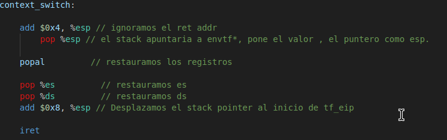

Estado inicial del stack, antes de mover el trapframe al %esp.

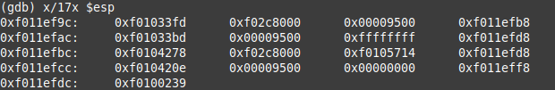

Luego de ejecutar `-> add $0x4, %esp` para ignorar el return address.

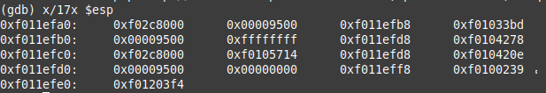

Ejecuto la siguiente instrucción  `-> pop %esp` para mover al stack pointer el trapframe y poder restaurar los registros.

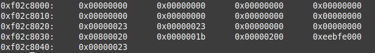

`-> popal // Restauramos los registros de uso general`

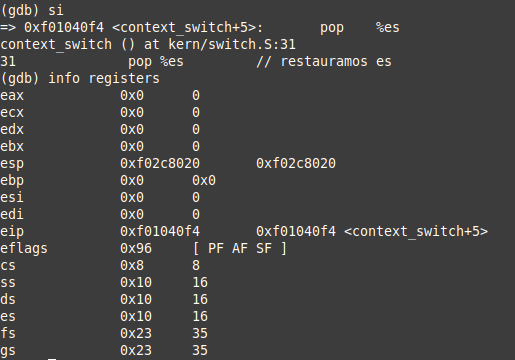

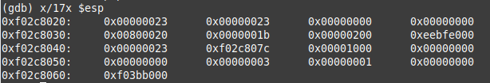

`-> pop %es // Restauramos es`

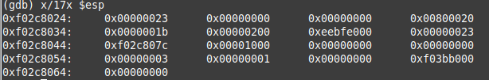

` -> pop %ds // Restauramos ds`

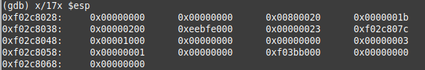

`-> add $0x08, %esp // Desplazamos el stack pointer al inicio de tf_eip`

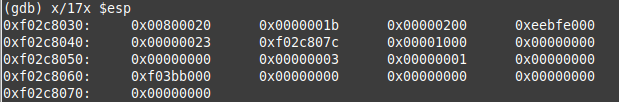

`iret // Volvemos con iret modificando los registros eip, cs y esp tomando los valores restantes del stack `

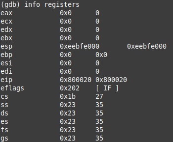

## Scheduler con Prioridades

#### Prioridades

El scheduler de prioridades plantea las prioridades como un numero en el struct env, denotado `env_priority`, acotado en el rango `MAX_PRIORITY` a `MIN_PRIORITY`. Un mayor `env_priority` representa menor prioridad.
Estos valores son customizables, constantes definidas en env.h, actualmente la `MAX_PRIORITY` es `1` y la `MIN_PRIORITY` es `10`. 

Al momento de crearse un nuevo env la función `env_create` se asigna la prioridad máxima. 
No se hace en `env_alloc` ya que la política para el fork es que el proceso nuevo va a tener la misma prioridad inicial que el padre. 

La prioridad existe tanto en Round Robin como para la version de prioridades. Pero Round Robin no la toma en cuenta aunque sí soporta las syscalls para el manejo de prioridades.

La syscalls en cuestion para el manejo de prioridades son `sys_get_priority` y `sys_lower_priority`. El get solo obtiene el atributo de env mencionado. Y el lower valida que la prioridad sea efectivamente menor y cambia la prioridad. En el caso de la versión de prioridades se actualiza las queues.

#### Manejo de prioridades

La implementación funciona con listas enlazadas que están sobre el arreglo envs, de forma similar a como funciona `env_link`. Se tiene `priority_next` que apunta al env siguiente en la prioridad. Aparte al ser una lista enlazada, se tiene una referencia al primero y último. Esto se puede observar en el struct:

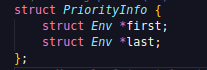

Se tiene una instacia de PriorityInfo para cada prioridad. 

A la hora de setear la prioridad en el env. Ademas de setearla como lo haria Round Robin. Actualiza la lista enlazada y el struct de la prioridad. Esto se puede observar en la funcion `add_to_priority`.

#### Seleccion del proceso a ejecutar
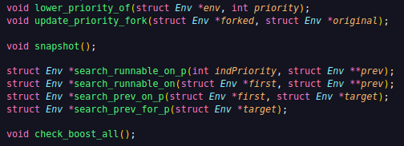

Para la seleccion del proceso a ejecutar se tienen 2 métodos principales para búsqueda.
El `search_runnable_on` que itera la lista hasta encontrar algún runnable. 
Si no se pasa un primer env. Se agarra el primero de la `PriorityInfo`

Y `search_prev_on_p` que a partir de un env target, itera la `PriorityInfo` asociada hasta encontrarlo.
Que existe para mantener la compatibilidad con las invocaciones a `env_run` de `trap.c`.

Como se observa ambos métodos devuelven el anterior, al párametro pasado, esto por si se quiere remover de la lista actual.

El metodo `remove_from_priority` toma al env a remover y el anterior. Y actualiza al anterior en caso de no ser null, para que apunte al siguiente del removido.

Actualizando el `PriorityInfo` de ser necesario.

Teniendo estos dos metodos `add_to_priority` y `remove_from_priority`. Se tiene el metodo encapsulador `lower_priority_of` que además válida la prioridad esté en el rango permitido.

Este método `lower_priority_of` es llamado en `env_run`, cada una cierta cantidad fija de runs. Denotada por la constante `RUNS_UNTIL_LOWER` del `env.h`.

Y además también es llamada por el `trap.c` al encontrar un timer interrupt y que el único proceso ejecutado sea el actual.
La cantidad disminuída es configurable por la constante `LOWER_ON_INTERRUPT` en `env.h`

Por último se tiene un sistema de boosting. Donde simplemente en cada `sched_yield` suma a un contandor y cuando pasan cierta cantidad de yields devuelve a todos los procesos vivos a la máxima prioridad. 
Configurable por la constante BOOST_TIMESLICE, la cantidad de sched_yields antes de un boost.

Para debugear 