# sched

### Parte 1: Context switch

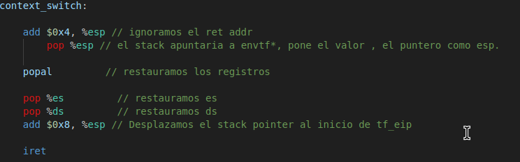

#### Estado inicial del stack

Antes de mover el trapframe al %esp.

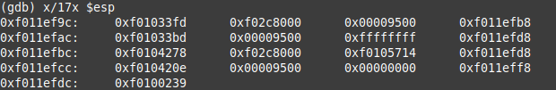

Luego de ejecutar `-> add $0x4, %esp` para ignorar el return address.

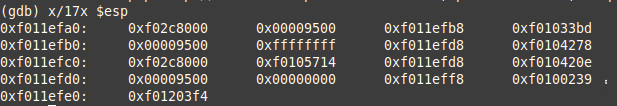

Ejecuto la siguiente instrucción  `-> pop %esp` para mover al stack pointer el trapframe y poder restaurar los registros.

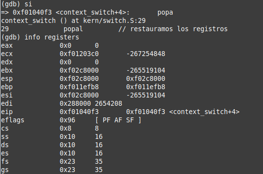

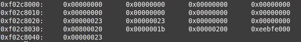

`-> popal // Restauramos los registros de uso general`

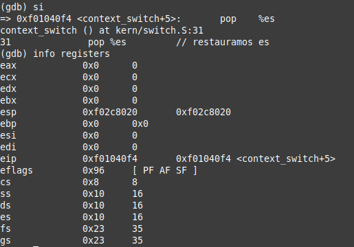

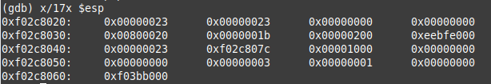

`-> pop %es // Restauramos es`

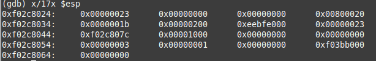

` -> pop %ds // Restauramos ds`

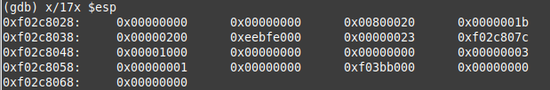

`-> add $0x08, %esp // Desplazamos el stack pointer al inicio de tf_eip`

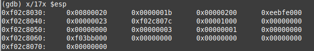

`iret // Volvemos con iret modificando los registros eip, cs y esp tomando los valores restantes del stack `

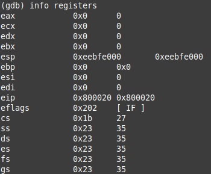

# Explicacion de scheduler de prioridad

El scheduler de prioridades planteado funciona con listas enlazadas, una para cada prioridad, que estan sobre el arreglo envs. Similar a como funciona env_link. Se tiene priority_next. Que apunta al siguiente en la prioridad. Aparte de ser una lista enlazada. Se tiene una referencia al primero y ultimo. Esto se puede observar en la struct

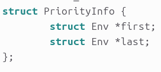

